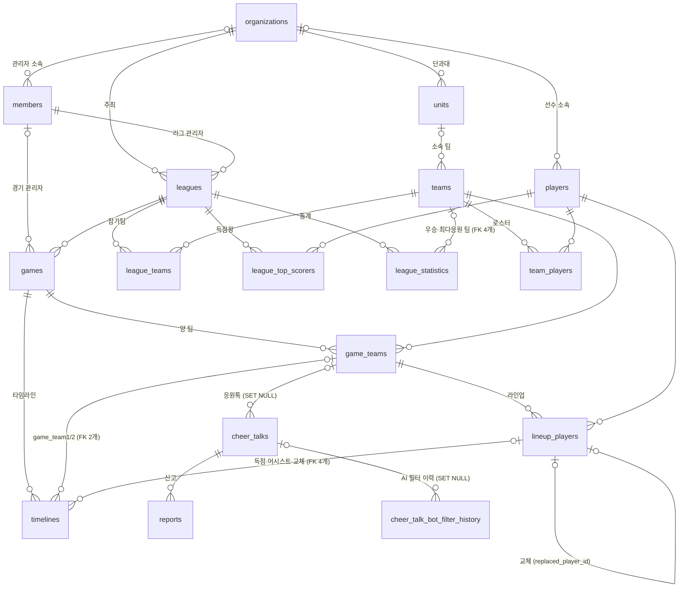

# DB 도메인 관계도 & 설계 노트

> **상세 스키마**(전체 컬럼·제약·인덱스·테이블별 ERD)는 [schema/](./schema)의 자동 생성 문서(tbls)로 관리합니다.
> 이 문서는 **한눈에 보는 도메인 관계**와, 자동 생성으로는 남지 않는 **설계 의도·히스토리**만 기록합니다.
>
> 기준: `db/migration/prod` V1–V18 (2026-06-10)

## 도메인 관계 요약

컬럼을 생략한 관계 수준 다이어그램입니다. `||`는 필수(NOT NULL FK), `|o`는 선택(NULL 허용 FK)을 의미합니다.

※ `pending_cheer_talks`는 FK가 없는 독립 아웃박스 테이블이라 다이어그램에서 생략했습니다 (아래 노트 참고).

## 설계 노트

### FK 삭제 정책 (의도적 결정 — 변경 전 확인 필요)

| 관계 | 정책 | 배경 |
|------|------|------|
| `cheer_talks.game_team_id` | `ON DELETE SET NULL` | 게임팀이 삭제돼도 응원톡은 보존 (V5에서 변경) |
| `cheer_talk_bot_filter_history.cheer_talk_id` | `ON DELETE SET NULL` | 응원톡 삭제 후에도 필터링 이력 보존 |
| `timelines.assist_lineup_player_id` | `ON DELETE CASCADE` | 라인업 삭제 시 어시스트 기록도 삭제 (V7) — **다른 lineup FK들(scorer 등)은 RESTRICT라 비대칭. 의도 여부 확인 필요** |
| 나머지 전부 | `RESTRICT` (기본) | 부모 삭제 불가 |

### 독립 테이블

- **`pending_cheer_talks`** — FK 없음. WebSocket 전송 대기 응원톡을 JSON으로 보관하는 아웃박스성 테이블.

### 조직 계층 변천 (참고)

- V10: `teams.organization_id` 직접 FK 추가 → V14: `units` 엔티티 도입 → **V18: `teams.organization_id` 제거**.
  현재 팀의 소속 조직은 `teams.unit_id → units.organization_id` 경로로만 조회 가능. 같은 FK를 다시 추가하기 전에 이 히스토리를 확인할 것.

### 유니크 제약의 맥락

| 테이블 | 제약 | 주의점 |
|--------|------|--------|
| `players` | `(organization_id, student_number)` | V17에서 전역 UNIQUE → 조직 스코프로 변경. **organization_id가 NULL인 레거시 행은 MySQL 복합 UNIQUE 특성상 중복 허용됨** |
| `team_players` | `(team_id, player_id)` | |
| `league_teams` | `(league_id, team_id)` | |
| `game_teams` | `(game_id, team_id)` | |
| `lineup_players` | `(game_team_id, player_id)` | |
