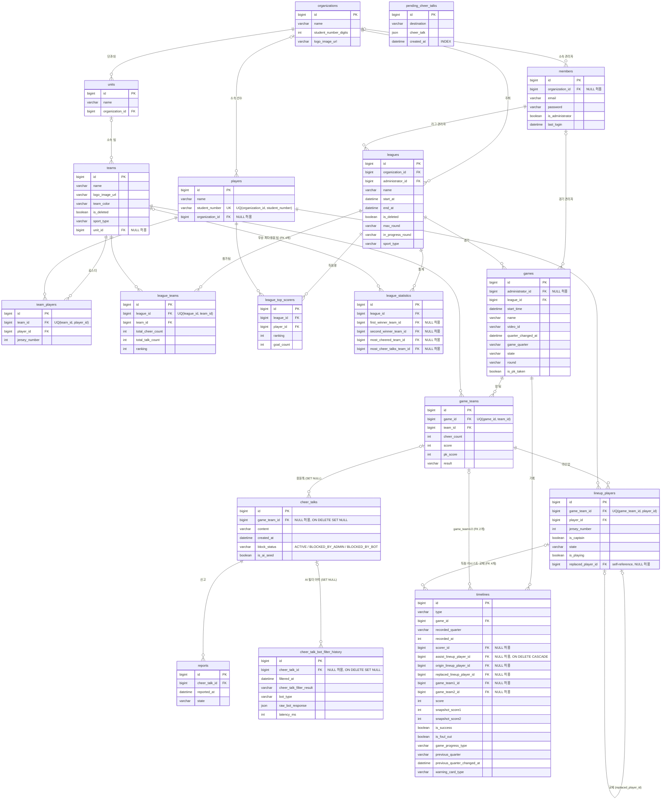

# Database ERD

> **생성 기준**: `db/migration/prod/` V1–V18을 MySQL 8.0에 순차 적용한 실제 스키마 (2026-06-10, develop `e9e07c85`)
>
> 스키마 변경 시 이 문서를 함께 갱신해 주세요. (tbls 자동화 도입 전까지 수동 관리)

## 전체 ERD

## 설계 노트

### FK 삭제 정책 (의도적 결정 — 변경 전 확인 필요)

| 관계 | 정책 | 배경 |
|------|------|------|
| `cheer_talks.game_team_id` | `ON DELETE SET NULL` | 게임팀이 삭제돼도 응원톡은 보존 (V5에서 변경) |
| `cheer_talk_bot_filter_history.cheer_talk_id` | `ON DELETE SET NULL` | 응원톡 삭제 후에도 필터링 이력 보존 |
| `timelines.assist_lineup_player_id` | `ON DELETE CASCADE` | 라인업 삭제 시 어시스트 기록도 삭제 (V7) — 다른 lineup FK들과 정책이 다름에 유의 |
| 나머지 전부 | `RESTRICT` (기본) | 부모 삭제 불가 |

### 독립 테이블

- **`pending_cheer_talks`** — FK 없음. WebSocket 전송 대기 응원톡을 JSON으로 보관하는 아웃박스성 테이블.

### 조직 계층 변천 (참고)

- V10: `teams.organization_id` 직접 FK 추가 → V14: `units` 엔티티 도입 → **V18: `teams.organization_id` 제거**.
  현재 팀의 소속 조직은 `teams.unit_id → units.organization_id` 경로로만 조회 가능.

### 유니크 제약

| 테이블 | 제약 |
|--------|------|
| `players` | `(organization_id, student_number)` — organization_id가 NULL인 레거시 행은 중복 허용 (V17) |
| `team_players` | `(team_id, player_id)` |
| `league_teams` | `(league_id, team_id)` |
| `game_teams` | `(game_id, team_id)` |
| `lineup_players` | `(game_team_id, player_id)` |
