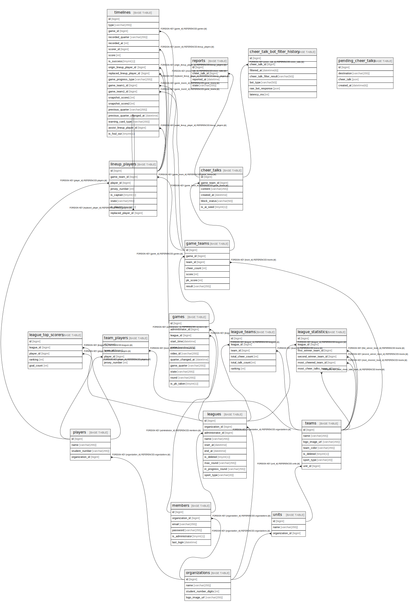

# hufscheer spectator-server

## Tables

| Name | Columns | Comment | Type |
| ---- | ------- | ------- | ---- |
| [cheer_talk_bot_filter_history](cheer_talk_bot_filter_history.md) | 7 |  | BASE TABLE |
| [cheer_talks](cheer_talks.md) | 6 |  | BASE TABLE |
| [game_teams](game_teams.md) | 7 |  | BASE TABLE |
| [games](games.md) | 11 |  | BASE TABLE |
| [league_statistics](league_statistics.md) | 6 |  | BASE TABLE |
| [league_teams](league_teams.md) | 6 |  | BASE TABLE |
| [league_top_scorers](league_top_scorers.md) | 5 |  | BASE TABLE |
| [leagues](leagues.md) | 10 |  | BASE TABLE |
| [lineup_players](lineup_players.md) | 8 |  | BASE TABLE |
| [members](members.md) | 6 |  | BASE TABLE |
| [organizations](organizations.md) | 4 |  | BASE TABLE |
| [pending_cheer_talks](pending_cheer_talks.md) | 4 |  | BASE TABLE |
| [players](players.md) | 4 |  | BASE TABLE |
| [reports](reports.md) | 4 |  | BASE TABLE |
| [team_players](team_players.md) | 4 |  | BASE TABLE |
| [teams](teams.md) | 7 |  | BASE TABLE |
| [timelines](timelines.md) | 20 |  | BASE TABLE |
| [units](units.md) | 3 |  | BASE TABLE |

## Relations

---

> Generated by [tbls](https://github.com/k1LoW/tbls)
