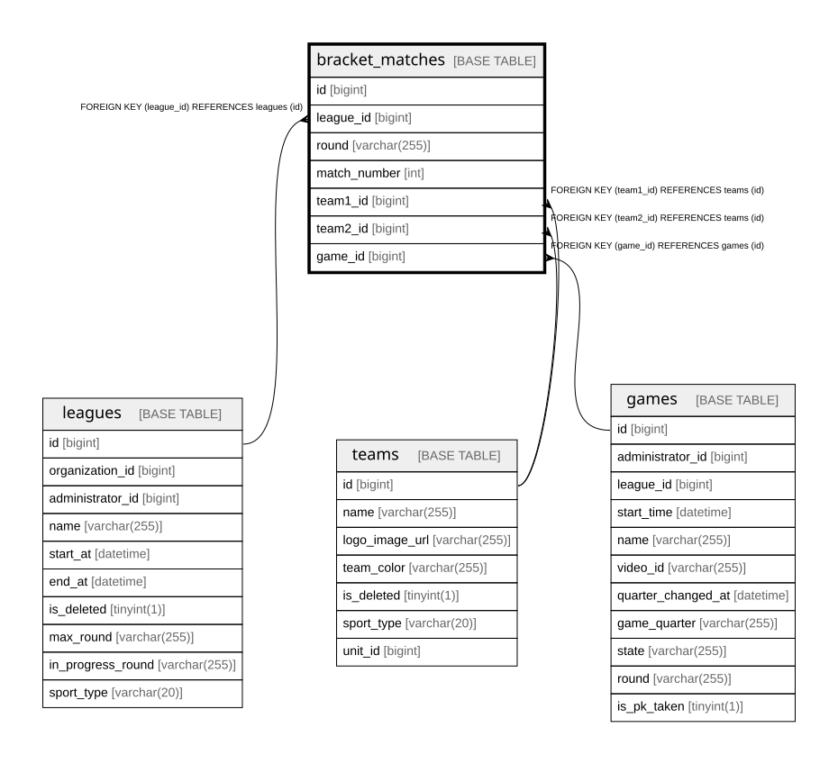

# bracket_matches

## Description

<details>
<summary><strong>Table Definition</strong></summary>

```sql
CREATE TABLE `bracket_matches` (
  `id` bigint NOT NULL AUTO_INCREMENT,
  `league_id` bigint NOT NULL,
  `round` varchar(255) NOT NULL,
  `match_number` int NOT NULL,
  `team1_id` bigint DEFAULT NULL,
  `team2_id` bigint DEFAULT NULL,
  `game_id` bigint DEFAULT NULL,
  PRIMARY KEY (`id`),
  UNIQUE KEY `uc_bracket_match_position` (`league_id`,`round`,`match_number`),
  UNIQUE KEY `uc_bracket_match_game` (`game_id`),
  KEY `FK_BRACKET_MATCHES_ON_TEAM1` (`team1_id`),
  KEY `FK_BRACKET_MATCHES_ON_TEAM2` (`team2_id`),
  CONSTRAINT `FK_BRACKET_MATCHES_ON_GAMES` FOREIGN KEY (`game_id`) REFERENCES `games` (`id`),
  CONSTRAINT `FK_BRACKET_MATCHES_ON_LEAGUES` FOREIGN KEY (`league_id`) REFERENCES `leagues` (`id`),
  CONSTRAINT `FK_BRACKET_MATCHES_ON_TEAM1` FOREIGN KEY (`team1_id`) REFERENCES `teams` (`id`),
  CONSTRAINT `FK_BRACKET_MATCHES_ON_TEAM2` FOREIGN KEY (`team2_id`) REFERENCES `teams` (`id`)
) ENGINE=InnoDB DEFAULT CHARSET=utf8mb4 COLLATE=utf8mb4_0900_ai_ci
```

</details>

## Columns

| Name | Type | Default | Nullable | Extra Definition | Children | Parents | Comment |
| ---- | ---- | ------- | -------- | ---------------- | -------- | ------- | ------- |
| id | bigint |  | false | auto_increment |  |  |  |
| league_id | bigint |  | false |  |  | [leagues](leagues.md) |  |
| round | varchar(255) |  | false |  |  |  |  |
| match_number | int |  | false |  |  |  |  |
| team1_id | bigint |  | true |  |  | [teams](teams.md) |  |
| team2_id | bigint |  | true |  |  | [teams](teams.md) |  |
| game_id | bigint |  | true |  |  | [games](games.md) |  |

## Constraints

| Name | Type | Definition |
| ---- | ---- | ---------- |
| FK_BRACKET_MATCHES_ON_GAMES | FOREIGN KEY | FOREIGN KEY (game_id) REFERENCES games (id) |
| FK_BRACKET_MATCHES_ON_LEAGUES | FOREIGN KEY | FOREIGN KEY (league_id) REFERENCES leagues (id) |
| FK_BRACKET_MATCHES_ON_TEAM1 | FOREIGN KEY | FOREIGN KEY (team1_id) REFERENCES teams (id) |
| FK_BRACKET_MATCHES_ON_TEAM2 | FOREIGN KEY | FOREIGN KEY (team2_id) REFERENCES teams (id) |
| PRIMARY | PRIMARY KEY | PRIMARY KEY (id) |
| uc_bracket_match_game | UNIQUE | UNIQUE KEY uc_bracket_match_game (game_id) |
| uc_bracket_match_position | UNIQUE | UNIQUE KEY uc_bracket_match_position (league_id, round, match_number) |

## Indexes

| Name | Definition |
| ---- | ---------- |
| FK_BRACKET_MATCHES_ON_TEAM1 | KEY FK_BRACKET_MATCHES_ON_TEAM1 (team1_id) USING BTREE |
| FK_BRACKET_MATCHES_ON_TEAM2 | KEY FK_BRACKET_MATCHES_ON_TEAM2 (team2_id) USING BTREE |
| PRIMARY | PRIMARY KEY (id) USING BTREE |
| uc_bracket_match_game | UNIQUE KEY uc_bracket_match_game (game_id) USING BTREE |
| uc_bracket_match_position | UNIQUE KEY uc_bracket_match_position (league_id, round, match_number) USING BTREE |

## Relations



---

> Generated by [tbls](https://github.com/k1LoW/tbls)
