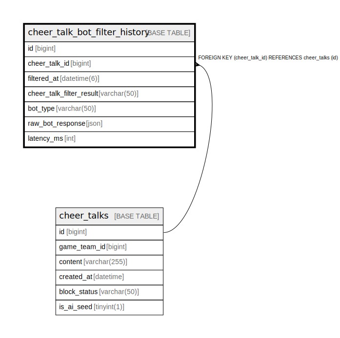

# cheer_talk_bot_filter_history

## Description

<details>
<summary><strong>Table Definition</strong></summary>

```sql
CREATE TABLE `cheer_talk_bot_filter_history` (
  `id` bigint NOT NULL AUTO_INCREMENT,
  `cheer_talk_id` bigint DEFAULT NULL,
  `filtered_at` datetime(6) NOT NULL,
  `cheer_talk_filter_result` varchar(50) NOT NULL,
  `bot_type` varchar(50) NOT NULL,
  `raw_bot_response` json NOT NULL,
  `latency_ms` int DEFAULT NULL,
  PRIMARY KEY (`id`),
  KEY `fk_cheer_talk_bot_filter_history_cheer_talk` (`cheer_talk_id`),
  CONSTRAINT `fk_cheer_talk_bot_filter_history_cheer_talk` FOREIGN KEY (`cheer_talk_id`) REFERENCES `cheer_talks` (`id`) ON DELETE SET NULL
) ENGINE=InnoDB DEFAULT CHARSET=utf8mb4 COLLATE=utf8mb4_0900_ai_ci
```

</details>

## Columns

| Name | Type | Default | Nullable | Extra Definition | Children | Parents | Comment |
| ---- | ---- | ------- | -------- | ---------------- | -------- | ------- | ------- |
| id | bigint |  | false | auto_increment |  |  |  |
| cheer_talk_id | bigint |  | true |  |  | [cheer_talks](cheer_talks.md) |  |
| filtered_at | datetime(6) |  | false |  |  |  |  |
| cheer_talk_filter_result | varchar(50) |  | false |  |  |  |  |
| bot_type | varchar(50) |  | false |  |  |  |  |
| raw_bot_response | json |  | false |  |  |  |  |
| latency_ms | int |  | true |  |  |  |  |

## Constraints

| Name | Type | Definition |
| ---- | ---- | ---------- |
| fk_cheer_talk_bot_filter_history_cheer_talk | FOREIGN KEY | FOREIGN KEY (cheer_talk_id) REFERENCES cheer_talks (id) |
| PRIMARY | PRIMARY KEY | PRIMARY KEY (id) |

## Indexes

| Name | Definition |
| ---- | ---------- |
| fk_cheer_talk_bot_filter_history_cheer_talk | KEY fk_cheer_talk_bot_filter_history_cheer_talk (cheer_talk_id) USING BTREE |
| PRIMARY | PRIMARY KEY (id) USING BTREE |

## Relations



---

> Generated by [tbls](https://github.com/k1LoW/tbls)
