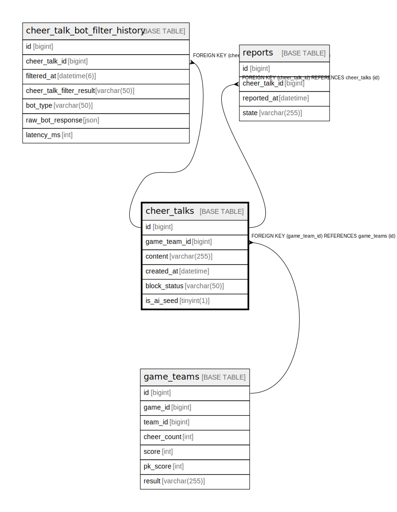

# cheer_talks

## Description

<details>
<summary><strong>Table Definition</strong></summary>

```sql
CREATE TABLE `cheer_talks` (
  `id` bigint NOT NULL AUTO_INCREMENT,
  `game_team_id` bigint DEFAULT NULL,
  `content` varchar(255) NOT NULL,
  `created_at` datetime NOT NULL,
  `block_status` varchar(50) NOT NULL DEFAULT 'ACTIVE',
  `is_ai_seed` tinyint(1) NOT NULL DEFAULT '0',
  PRIMARY KEY (`id`),
  KEY `FK_CHEER_TALKS_ON_GAME_TEAMS` (`game_team_id`),
  CONSTRAINT `FK_CHEER_TALKS_ON_GAME_TEAMS` FOREIGN KEY (`game_team_id`) REFERENCES `game_teams` (`id`) ON DELETE SET NULL
) ENGINE=InnoDB DEFAULT CHARSET=utf8mb4 COLLATE=utf8mb4_0900_ai_ci
```

</details>

## Columns

| Name | Type | Default | Nullable | Extra Definition | Children | Parents | Comment |
| ---- | ---- | ------- | -------- | ---------------- | -------- | ------- | ------- |
| id | bigint |  | false | auto_increment | [cheer_talk_bot_filter_history](cheer_talk_bot_filter_history.md) [reports](reports.md) |  |  |
| game_team_id | bigint |  | true |  |  | [game_teams](game_teams.md) |  |
| content | varchar(255) |  | false |  |  |  |  |
| created_at | datetime |  | false |  |  |  |  |
| block_status | varchar(50) | ACTIVE | false |  |  |  |  |
| is_ai_seed | tinyint(1) | 0 | false |  |  |  |  |

## Constraints

| Name | Type | Definition |
| ---- | ---- | ---------- |
| FK_CHEER_TALKS_ON_GAME_TEAMS | FOREIGN KEY | FOREIGN KEY (game_team_id) REFERENCES game_teams (id) |
| PRIMARY | PRIMARY KEY | PRIMARY KEY (id) |

## Indexes

| Name | Definition |
| ---- | ---------- |
| FK_CHEER_TALKS_ON_GAME_TEAMS | KEY FK_CHEER_TALKS_ON_GAME_TEAMS (game_team_id) USING BTREE |
| PRIMARY | PRIMARY KEY (id) USING BTREE |

## Relations



---

> Generated by [tbls](https://github.com/k1LoW/tbls)
