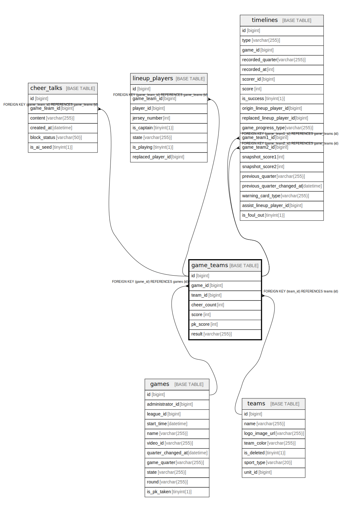

# game_teams

## Description

<details>
<summary><strong>Table Definition</strong></summary>

```sql
CREATE TABLE `game_teams` (
  `id` bigint NOT NULL AUTO_INCREMENT,
  `game_id` bigint NOT NULL,
  `team_id` bigint NOT NULL,
  `cheer_count` int NOT NULL DEFAULT '0',
  `score` int NOT NULL DEFAULT '0',
  `pk_score` int NOT NULL DEFAULT '0',
  `result` varchar(255) DEFAULT NULL,
  PRIMARY KEY (`id`),
  UNIQUE KEY `uc_game_team` (`game_id`,`team_id`),
  KEY `FK_GAME_TEAMS_ON_TEAMS` (`team_id`),
  CONSTRAINT `FK_GAME_TEAMS_ON_GAMES` FOREIGN KEY (`game_id`) REFERENCES `games` (`id`),
  CONSTRAINT `FK_GAME_TEAMS_ON_TEAMS` FOREIGN KEY (`team_id`) REFERENCES `teams` (`id`)
) ENGINE=InnoDB DEFAULT CHARSET=utf8mb4 COLLATE=utf8mb4_0900_ai_ci
```

</details>

## Columns

| Name | Type | Default | Nullable | Extra Definition | Children | Parents | Comment |
| ---- | ---- | ------- | -------- | ---------------- | -------- | ------- | ------- |
| id | bigint |  | false | auto_increment | [cheer_talks](cheer_talks.md) [lineup_players](lineup_players.md) [timelines](timelines.md) |  |  |
| game_id | bigint |  | false |  |  | [games](games.md) |  |
| team_id | bigint |  | false |  |  | [teams](teams.md) |  |
| cheer_count | int | 0 | false |  |  |  |  |
| score | int | 0 | false |  |  |  |  |
| pk_score | int | 0 | false |  |  |  |  |
| result | varchar(255) |  | true |  |  |  |  |

## Constraints

| Name | Type | Definition |
| ---- | ---- | ---------- |
| FK_GAME_TEAMS_ON_GAMES | FOREIGN KEY | FOREIGN KEY (game_id) REFERENCES games (id) |
| FK_GAME_TEAMS_ON_TEAMS | FOREIGN KEY | FOREIGN KEY (team_id) REFERENCES teams (id) |
| PRIMARY | PRIMARY KEY | PRIMARY KEY (id) |
| uc_game_team | UNIQUE | UNIQUE KEY uc_game_team (game_id, team_id) |

## Indexes

| Name | Definition |
| ---- | ---------- |
| FK_GAME_TEAMS_ON_TEAMS | KEY FK_GAME_TEAMS_ON_TEAMS (team_id) USING BTREE |
| PRIMARY | PRIMARY KEY (id) USING BTREE |
| uc_game_team | UNIQUE KEY uc_game_team (game_id, team_id) USING BTREE |

## Relations



---

> Generated by [tbls](https://github.com/k1LoW/tbls)
