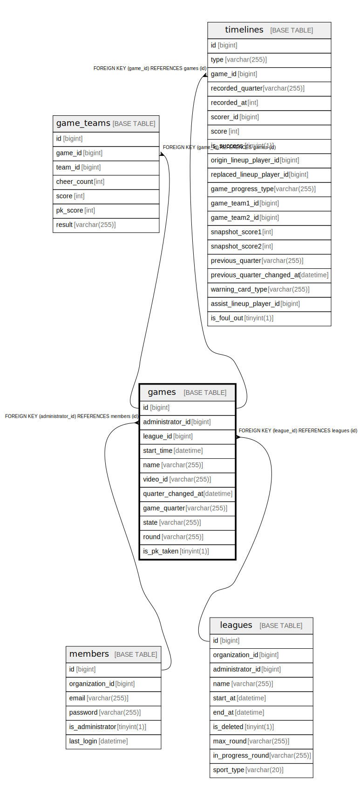

# games

## Description

<details>
<summary><strong>Table Definition</strong></summary>

```sql
CREATE TABLE `games` (
  `id` bigint NOT NULL AUTO_INCREMENT,
  `administrator_id` bigint DEFAULT NULL,
  `league_id` bigint NOT NULL,
  `start_time` datetime NOT NULL,
  `name` varchar(255) DEFAULT NULL,
  `video_id` varchar(255) DEFAULT NULL,
  `quarter_changed_at` datetime DEFAULT NULL,
  `game_quarter` varchar(255) DEFAULT NULL,
  `state` varchar(255) DEFAULT NULL,
  `round` varchar(255) NOT NULL,
  `is_pk_taken` tinyint(1) NOT NULL DEFAULT '0',
  PRIMARY KEY (`id`),
  KEY `FK_GAMES_ON_MEMBERS` (`administrator_id`),
  KEY `FK_GAMES_ON_LEAGUES` (`league_id`),
  CONSTRAINT `FK_GAMES_ON_LEAGUES` FOREIGN KEY (`league_id`) REFERENCES `leagues` (`id`),
  CONSTRAINT `FK_GAMES_ON_MEMBERS` FOREIGN KEY (`administrator_id`) REFERENCES `members` (`id`)
) ENGINE=InnoDB DEFAULT CHARSET=utf8mb4 COLLATE=utf8mb4_0900_ai_ci
```

</details>

## Columns

| Name | Type | Default | Nullable | Extra Definition | Children | Parents | Comment |
| ---- | ---- | ------- | -------- | ---------------- | -------- | ------- | ------- |
| id | bigint |  | false | auto_increment | [game_teams](game_teams.md) [timelines](timelines.md) |  |  |
| administrator_id | bigint |  | true |  |  | [members](members.md) |  |
| league_id | bigint |  | false |  |  | [leagues](leagues.md) |  |
| start_time | datetime |  | false |  |  |  |  |
| name | varchar(255) |  | true |  |  |  |  |
| video_id | varchar(255) |  | true |  |  |  |  |
| quarter_changed_at | datetime |  | true |  |  |  |  |
| game_quarter | varchar(255) |  | true |  |  |  |  |
| state | varchar(255) |  | true |  |  |  |  |
| round | varchar(255) |  | false |  |  |  |  |
| is_pk_taken | tinyint(1) | 0 | false |  |  |  |  |

## Constraints

| Name | Type | Definition |
| ---- | ---- | ---------- |
| FK_GAMES_ON_LEAGUES | FOREIGN KEY | FOREIGN KEY (league_id) REFERENCES leagues (id) |
| FK_GAMES_ON_MEMBERS | FOREIGN KEY | FOREIGN KEY (administrator_id) REFERENCES members (id) |
| PRIMARY | PRIMARY KEY | PRIMARY KEY (id) |

## Indexes

| Name | Definition |
| ---- | ---------- |
| FK_GAMES_ON_LEAGUES | KEY FK_GAMES_ON_LEAGUES (league_id) USING BTREE |
| FK_GAMES_ON_MEMBERS | KEY FK_GAMES_ON_MEMBERS (administrator_id) USING BTREE |
| PRIMARY | PRIMARY KEY (id) USING BTREE |

## Relations



---

> Generated by [tbls](https://github.com/k1LoW/tbls)
