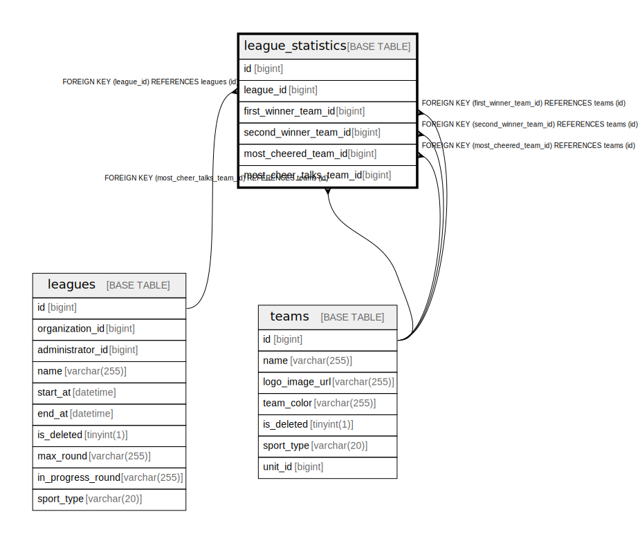

# league_statistics

## Description

<details>
<summary><strong>Table Definition</strong></summary>

```sql
CREATE TABLE `league_statistics` (
  `id` bigint NOT NULL AUTO_INCREMENT,
  `league_id` bigint NOT NULL,
  `first_winner_team_id` bigint DEFAULT NULL,
  `second_winner_team_id` bigint DEFAULT NULL,
  `most_cheered_team_id` bigint DEFAULT NULL,
  `most_cheer_talks_team_id` bigint DEFAULT NULL,
  PRIMARY KEY (`id`),
  KEY `FK_LEAGUE_STATISTICS_ON_LEAGUES` (`league_id`),
  KEY `FK_LEAGUE_STATISTICS_ON_TEAMS_FIRST_WINNER` (`first_winner_team_id`),
  KEY `FK_LEAGUE_STATISTICS_ON_TEAMS_SECOND_WINNER` (`second_winner_team_id`),
  KEY `FK_LEAGUE_STATISTICS_ON_TEAMS_MOST_CHEERED` (`most_cheered_team_id`),
  KEY `FK_LEAGUE_STATISTICS_ON_TEAMS_MOST_TALKS` (`most_cheer_talks_team_id`),
  CONSTRAINT `FK_LEAGUE_STATISTICS_ON_LEAGUES` FOREIGN KEY (`league_id`) REFERENCES `leagues` (`id`),
  CONSTRAINT `FK_LEAGUE_STATISTICS_ON_TEAMS_FIRST_WINNER` FOREIGN KEY (`first_winner_team_id`) REFERENCES `teams` (`id`),
  CONSTRAINT `FK_LEAGUE_STATISTICS_ON_TEAMS_MOST_CHEERED` FOREIGN KEY (`most_cheered_team_id`) REFERENCES `teams` (`id`),
  CONSTRAINT `FK_LEAGUE_STATISTICS_ON_TEAMS_MOST_TALKS` FOREIGN KEY (`most_cheer_talks_team_id`) REFERENCES `teams` (`id`),
  CONSTRAINT `FK_LEAGUE_STATISTICS_ON_TEAMS_SECOND_WINNER` FOREIGN KEY (`second_winner_team_id`) REFERENCES `teams` (`id`)
) ENGINE=InnoDB DEFAULT CHARSET=utf8mb4 COLLATE=utf8mb4_0900_ai_ci
```

</details>

## Columns

| Name | Type | Default | Nullable | Extra Definition | Children | Parents | Comment |
| ---- | ---- | ------- | -------- | ---------------- | -------- | ------- | ------- |
| id | bigint |  | false | auto_increment |  |  |  |
| league_id | bigint |  | false |  |  | [leagues](leagues.md) |  |
| first_winner_team_id | bigint |  | true |  |  | [teams](teams.md) |  |
| second_winner_team_id | bigint |  | true |  |  | [teams](teams.md) |  |
| most_cheered_team_id | bigint |  | true |  |  | [teams](teams.md) |  |
| most_cheer_talks_team_id | bigint |  | true |  |  | [teams](teams.md) |  |

## Constraints

| Name | Type | Definition |
| ---- | ---- | ---------- |
| FK_LEAGUE_STATISTICS_ON_LEAGUES | FOREIGN KEY | FOREIGN KEY (league_id) REFERENCES leagues (id) |
| FK_LEAGUE_STATISTICS_ON_TEAMS_FIRST_WINNER | FOREIGN KEY | FOREIGN KEY (first_winner_team_id) REFERENCES teams (id) |
| FK_LEAGUE_STATISTICS_ON_TEAMS_MOST_CHEERED | FOREIGN KEY | FOREIGN KEY (most_cheered_team_id) REFERENCES teams (id) |
| FK_LEAGUE_STATISTICS_ON_TEAMS_MOST_TALKS | FOREIGN KEY | FOREIGN KEY (most_cheer_talks_team_id) REFERENCES teams (id) |
| FK_LEAGUE_STATISTICS_ON_TEAMS_SECOND_WINNER | FOREIGN KEY | FOREIGN KEY (second_winner_team_id) REFERENCES teams (id) |
| PRIMARY | PRIMARY KEY | PRIMARY KEY (id) |

## Indexes

| Name | Definition |
| ---- | ---------- |
| FK_LEAGUE_STATISTICS_ON_LEAGUES | KEY FK_LEAGUE_STATISTICS_ON_LEAGUES (league_id) USING BTREE |
| FK_LEAGUE_STATISTICS_ON_TEAMS_FIRST_WINNER | KEY FK_LEAGUE_STATISTICS_ON_TEAMS_FIRST_WINNER (first_winner_team_id) USING BTREE |
| FK_LEAGUE_STATISTICS_ON_TEAMS_MOST_CHEERED | KEY FK_LEAGUE_STATISTICS_ON_TEAMS_MOST_CHEERED (most_cheered_team_id) USING BTREE |
| FK_LEAGUE_STATISTICS_ON_TEAMS_MOST_TALKS | KEY FK_LEAGUE_STATISTICS_ON_TEAMS_MOST_TALKS (most_cheer_talks_team_id) USING BTREE |
| FK_LEAGUE_STATISTICS_ON_TEAMS_SECOND_WINNER | KEY FK_LEAGUE_STATISTICS_ON_TEAMS_SECOND_WINNER (second_winner_team_id) USING BTREE |
| PRIMARY | PRIMARY KEY (id) USING BTREE |

## Relations



---

> Generated by [tbls](https://github.com/k1LoW/tbls)
