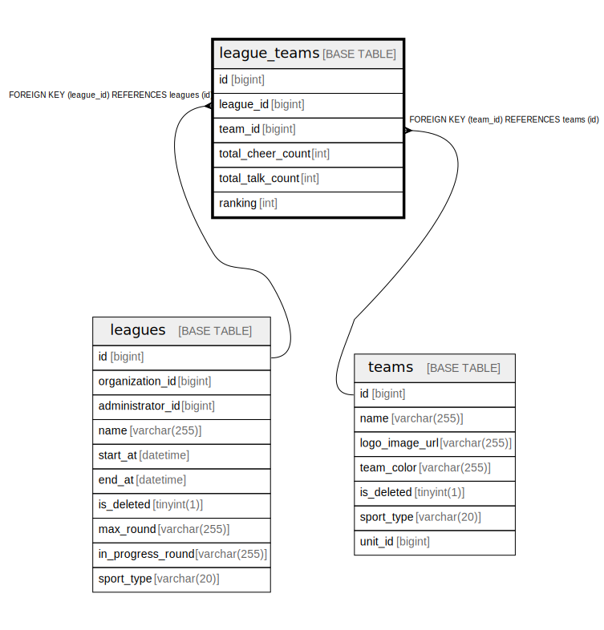

# league_teams

## Description

<details>
<summary><strong>Table Definition</strong></summary>

```sql
CREATE TABLE `league_teams` (
  `id` bigint NOT NULL AUTO_INCREMENT,
  `league_id` bigint NOT NULL,
  `team_id` bigint NOT NULL,
  `total_cheer_count` int NOT NULL DEFAULT '0',
  `total_talk_count` int NOT NULL DEFAULT '0',
  `ranking` int DEFAULT NULL,
  PRIMARY KEY (`id`),
  UNIQUE KEY `uc_league_team` (`league_id`,`team_id`),
  KEY `FK_LEAGUE_TEAMS_ON_TEAMS` (`team_id`),
  CONSTRAINT `FK_LEAGUE_TEAMS_ON_LEAGUES` FOREIGN KEY (`league_id`) REFERENCES `leagues` (`id`),
  CONSTRAINT `FK_LEAGUE_TEAMS_ON_TEAMS` FOREIGN KEY (`team_id`) REFERENCES `teams` (`id`)
) ENGINE=InnoDB DEFAULT CHARSET=utf8mb4 COLLATE=utf8mb4_0900_ai_ci
```

</details>

## Columns

| Name | Type | Default | Nullable | Extra Definition | Children | Parents | Comment |
| ---- | ---- | ------- | -------- | ---------------- | -------- | ------- | ------- |
| id | bigint |  | false | auto_increment |  |  |  |
| league_id | bigint |  | false |  |  | [leagues](leagues.md) |  |
| team_id | bigint |  | false |  |  | [teams](teams.md) |  |
| total_cheer_count | int | 0 | false |  |  |  |  |
| total_talk_count | int | 0 | false |  |  |  |  |
| ranking | int |  | true |  |  |  |  |

## Constraints

| Name | Type | Definition |
| ---- | ---- | ---------- |
| FK_LEAGUE_TEAMS_ON_LEAGUES | FOREIGN KEY | FOREIGN KEY (league_id) REFERENCES leagues (id) |
| FK_LEAGUE_TEAMS_ON_TEAMS | FOREIGN KEY | FOREIGN KEY (team_id) REFERENCES teams (id) |
| PRIMARY | PRIMARY KEY | PRIMARY KEY (id) |
| uc_league_team | UNIQUE | UNIQUE KEY uc_league_team (league_id, team_id) |

## Indexes

| Name | Definition |
| ---- | ---------- |
| FK_LEAGUE_TEAMS_ON_TEAMS | KEY FK_LEAGUE_TEAMS_ON_TEAMS (team_id) USING BTREE |
| PRIMARY | PRIMARY KEY (id) USING BTREE |
| uc_league_team | UNIQUE KEY uc_league_team (league_id, team_id) USING BTREE |

## Relations



---

> Generated by [tbls](https://github.com/k1LoW/tbls)
