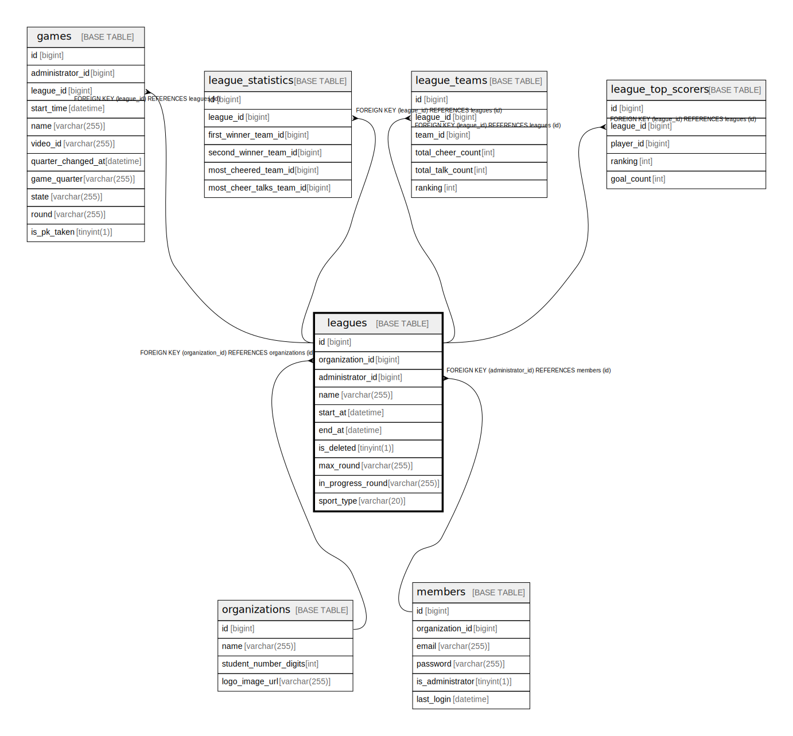

# leagues

## Description

<details>
<summary><strong>Table Definition</strong></summary>

```sql
CREATE TABLE `leagues` (
  `id` bigint NOT NULL AUTO_INCREMENT,
  `organization_id` bigint NOT NULL,
  `administrator_id` bigint NOT NULL,
  `name` varchar(255) NOT NULL,
  `start_at` datetime NOT NULL,
  `end_at` datetime NOT NULL,
  `is_deleted` tinyint(1) NOT NULL DEFAULT '0',
  `max_round` varchar(255) DEFAULT NULL,
  `in_progress_round` varchar(255) DEFAULT NULL,
  `sport_type` varchar(20) NOT NULL DEFAULT 'SOCCER',
  PRIMARY KEY (`id`),
  KEY `FK_LEAGUES_ON_ORGANIZATIONS` (`organization_id`),
  KEY `FK_LEAGUES_ON_MEMBERS` (`administrator_id`),
  CONSTRAINT `FK_LEAGUES_ON_MEMBERS` FOREIGN KEY (`administrator_id`) REFERENCES `members` (`id`),
  CONSTRAINT `FK_LEAGUES_ON_ORGANIZATIONS` FOREIGN KEY (`organization_id`) REFERENCES `organizations` (`id`)
) ENGINE=InnoDB DEFAULT CHARSET=utf8mb4 COLLATE=utf8mb4_0900_ai_ci
```

</details>

## Columns

| Name | Type | Default | Nullable | Extra Definition | Children | Parents | Comment |
| ---- | ---- | ------- | -------- | ---------------- | -------- | ------- | ------- |
| id | bigint |  | false | auto_increment | [games](games.md) [league_statistics](league_statistics.md) [league_teams](league_teams.md) [league_top_scorers](league_top_scorers.md) |  |  |
| organization_id | bigint |  | false |  |  | [organizations](organizations.md) |  |
| administrator_id | bigint |  | false |  |  | [members](members.md) |  |
| name | varchar(255) |  | false |  |  |  |  |
| start_at | datetime |  | false |  |  |  |  |
| end_at | datetime |  | false |  |  |  |  |
| is_deleted | tinyint(1) | 0 | false |  |  |  |  |
| max_round | varchar(255) |  | true |  |  |  |  |
| in_progress_round | varchar(255) |  | true |  |  |  |  |
| sport_type | varchar(20) | SOCCER | false |  |  |  |  |

## Constraints

| Name | Type | Definition |
| ---- | ---- | ---------- |
| FK_LEAGUES_ON_MEMBERS | FOREIGN KEY | FOREIGN KEY (administrator_id) REFERENCES members (id) |
| FK_LEAGUES_ON_ORGANIZATIONS | FOREIGN KEY | FOREIGN KEY (organization_id) REFERENCES organizations (id) |
| PRIMARY | PRIMARY KEY | PRIMARY KEY (id) |

## Indexes

| Name | Definition |
| ---- | ---------- |
| FK_LEAGUES_ON_MEMBERS | KEY FK_LEAGUES_ON_MEMBERS (administrator_id) USING BTREE |
| FK_LEAGUES_ON_ORGANIZATIONS | KEY FK_LEAGUES_ON_ORGANIZATIONS (organization_id) USING BTREE |
| PRIMARY | PRIMARY KEY (id) USING BTREE |

## Relations



---

> Generated by [tbls](https://github.com/k1LoW/tbls)
