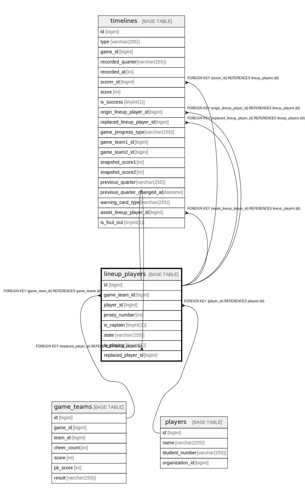

# lineup_players

## Description

<details>
<summary><strong>Table Definition</strong></summary>

```sql
CREATE TABLE `lineup_players` (
  `id` bigint NOT NULL AUTO_INCREMENT,
  `game_team_id` bigint NOT NULL,
  `player_id` bigint NOT NULL,
  `jersey_number` int DEFAULT NULL,
  `is_captain` tinyint(1) NOT NULL DEFAULT '0',
  `state` varchar(255) NOT NULL,
  `is_playing` tinyint(1) NOT NULL DEFAULT '1',
  `replaced_player_id` bigint DEFAULT NULL,
  PRIMARY KEY (`id`),
  UNIQUE KEY `uc_lineup_player` (`game_team_id`,`player_id`),
  KEY `FK_LINEUP_PLAYERS_ON_PLAYERS` (`player_id`),
  KEY `FK_LINEUP_PLAYERS_ON_REPLACED_PLAYER` (`replaced_player_id`),
  CONSTRAINT `FK_LINEUP_PLAYERS_ON_GAME_TEAMS` FOREIGN KEY (`game_team_id`) REFERENCES `game_teams` (`id`),
  CONSTRAINT `FK_LINEUP_PLAYERS_ON_PLAYERS` FOREIGN KEY (`player_id`) REFERENCES `players` (`id`),
  CONSTRAINT `FK_LINEUP_PLAYERS_ON_REPLACED_PLAYER` FOREIGN KEY (`replaced_player_id`) REFERENCES `lineup_players` (`id`)
) ENGINE=InnoDB DEFAULT CHARSET=utf8mb4 COLLATE=utf8mb4_0900_ai_ci
```

</details>

## Columns

| Name | Type | Default | Nullable | Extra Definition | Children | Parents | Comment |
| ---- | ---- | ------- | -------- | ---------------- | -------- | ------- | ------- |
| id | bigint |  | false | auto_increment | [lineup_players](lineup_players.md) [timelines](timelines.md) |  |  |
| game_team_id | bigint |  | false |  |  | [game_teams](game_teams.md) |  |
| player_id | bigint |  | false |  |  | [players](players.md) |  |
| jersey_number | int |  | true |  |  |  |  |
| is_captain | tinyint(1) | 0 | false |  |  |  |  |
| state | varchar(255) |  | false |  |  |  |  |
| is_playing | tinyint(1) | 1 | false |  |  |  |  |
| replaced_player_id | bigint |  | true |  |  | [lineup_players](lineup_players.md) |  |

## Constraints

| Name | Type | Definition |
| ---- | ---- | ---------- |
| FK_LINEUP_PLAYERS_ON_GAME_TEAMS | FOREIGN KEY | FOREIGN KEY (game_team_id) REFERENCES game_teams (id) |
| FK_LINEUP_PLAYERS_ON_PLAYERS | FOREIGN KEY | FOREIGN KEY (player_id) REFERENCES players (id) |
| FK_LINEUP_PLAYERS_ON_REPLACED_PLAYER | FOREIGN KEY | FOREIGN KEY (replaced_player_id) REFERENCES lineup_players (id) |
| PRIMARY | PRIMARY KEY | PRIMARY KEY (id) |
| uc_lineup_player | UNIQUE | UNIQUE KEY uc_lineup_player (game_team_id, player_id) |

## Indexes

| Name | Definition |
| ---- | ---------- |
| FK_LINEUP_PLAYERS_ON_PLAYERS | KEY FK_LINEUP_PLAYERS_ON_PLAYERS (player_id) USING BTREE |
| FK_LINEUP_PLAYERS_ON_REPLACED_PLAYER | KEY FK_LINEUP_PLAYERS_ON_REPLACED_PLAYER (replaced_player_id) USING BTREE |
| PRIMARY | PRIMARY KEY (id) USING BTREE |
| uc_lineup_player | UNIQUE KEY uc_lineup_player (game_team_id, player_id) USING BTREE |

## Relations



---

> Generated by [tbls](https://github.com/k1LoW/tbls)
