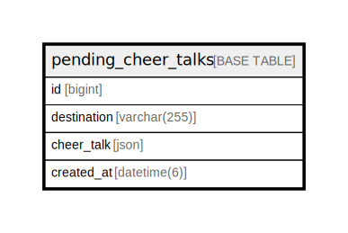

# pending_cheer_talks

## Description

<details>
<summary><strong>Table Definition</strong></summary>

```sql
CREATE TABLE `pending_cheer_talks` (
  `id` bigint NOT NULL AUTO_INCREMENT,
  `destination` varchar(255) NOT NULL,
  `cheer_talk` json NOT NULL,
  `created_at` datetime(6) NOT NULL,
  PRIMARY KEY (`id`),
  KEY `idx_pending_cheer_talks_created_at` (`created_at`)
) ENGINE=InnoDB DEFAULT CHARSET=utf8mb4 COLLATE=utf8mb4_0900_ai_ci
```

</details>

## Columns

| Name | Type | Default | Nullable | Extra Definition | Children | Parents | Comment |
| ---- | ---- | ------- | -------- | ---------------- | -------- | ------- | ------- |
| id | bigint |  | false | auto_increment |  |  |  |
| destination | varchar(255) |  | false |  |  |  |  |
| cheer_talk | json |  | false |  |  |  |  |
| created_at | datetime(6) |  | false |  |  |  |  |

## Constraints

| Name | Type | Definition |
| ---- | ---- | ---------- |
| PRIMARY | PRIMARY KEY | PRIMARY KEY (id) |

## Indexes

| Name | Definition |
| ---- | ---------- |
| idx_pending_cheer_talks_created_at | KEY idx_pending_cheer_talks_created_at (created_at) USING BTREE |
| PRIMARY | PRIMARY KEY (id) USING BTREE |

## Relations



---

> Generated by [tbls](https://github.com/k1LoW/tbls)
