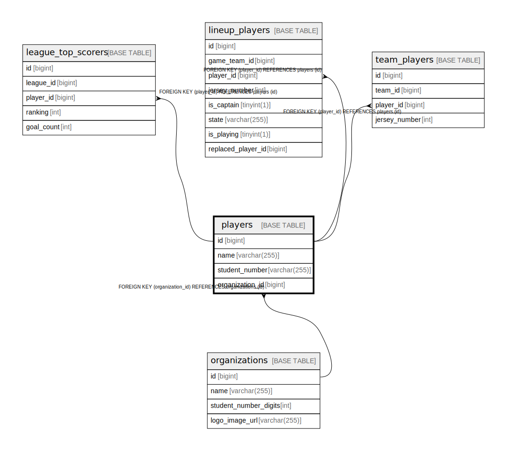

# players

## Description

<details>
<summary><strong>Table Definition</strong></summary>

```sql
CREATE TABLE `players` (
  `id` bigint NOT NULL AUTO_INCREMENT,
  `name` varchar(255) NOT NULL,
  `student_number` varchar(255) DEFAULT NULL,
  `organization_id` bigint DEFAULT NULL,
  PRIMARY KEY (`id`),
  UNIQUE KEY `uc_players_org_student_number` (`organization_id`,`student_number`),
  CONSTRAINT `FK_PLAYERS_ON_ORGANIZATION` FOREIGN KEY (`organization_id`) REFERENCES `organizations` (`id`)
) ENGINE=InnoDB DEFAULT CHARSET=utf8mb4 COLLATE=utf8mb4_0900_ai_ci
```

</details>

## Columns

| Name | Type | Default | Nullable | Extra Definition | Children | Parents | Comment |
| ---- | ---- | ------- | -------- | ---------------- | -------- | ------- | ------- |
| id | bigint |  | false | auto_increment | [league_top_scorers](league_top_scorers.md) [lineup_players](lineup_players.md) [team_players](team_players.md) |  |  |
| name | varchar(255) |  | false |  |  |  |  |
| student_number | varchar(255) |  | true |  |  |  |  |
| organization_id | bigint |  | true |  |  | [organizations](organizations.md) |  |

## Constraints

| Name | Type | Definition |
| ---- | ---- | ---------- |
| FK_PLAYERS_ON_ORGANIZATION | FOREIGN KEY | FOREIGN KEY (organization_id) REFERENCES organizations (id) |
| PRIMARY | PRIMARY KEY | PRIMARY KEY (id) |
| uc_players_org_student_number | UNIQUE | UNIQUE KEY uc_players_org_student_number (organization_id, student_number) |

## Indexes

| Name | Definition |
| ---- | ---------- |
| PRIMARY | PRIMARY KEY (id) USING BTREE |
| uc_players_org_student_number | UNIQUE KEY uc_players_org_student_number (organization_id, student_number) USING BTREE |

## Relations



---

> Generated by [tbls](https://github.com/k1LoW/tbls)
