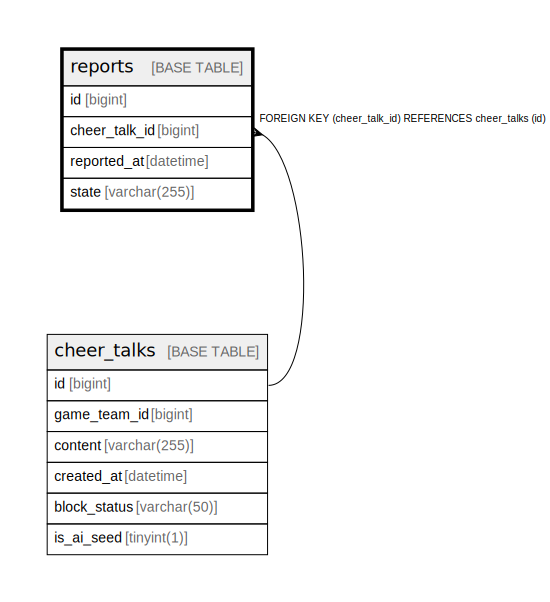

# reports

## Description

<details>
<summary><strong>Table Definition</strong></summary>

```sql
CREATE TABLE `reports` (
  `id` bigint NOT NULL AUTO_INCREMENT,
  `cheer_talk_id` bigint NOT NULL,
  `reported_at` datetime NOT NULL,
  `state` varchar(255) NOT NULL,
  PRIMARY KEY (`id`),
  KEY `FK_REPORTS_ON_CHEER_TALKS` (`cheer_talk_id`),
  CONSTRAINT `FK_REPORTS_ON_CHEER_TALKS` FOREIGN KEY (`cheer_talk_id`) REFERENCES `cheer_talks` (`id`)
) ENGINE=InnoDB DEFAULT CHARSET=utf8mb4 COLLATE=utf8mb4_0900_ai_ci
```

</details>

## Columns

| Name | Type | Default | Nullable | Extra Definition | Children | Parents | Comment |
| ---- | ---- | ------- | -------- | ---------------- | -------- | ------- | ------- |
| id | bigint |  | false | auto_increment |  |  |  |
| cheer_talk_id | bigint |  | false |  |  | [cheer_talks](cheer_talks.md) |  |
| reported_at | datetime |  | false |  |  |  |  |
| state | varchar(255) |  | false |  |  |  |  |

## Constraints

| Name | Type | Definition |
| ---- | ---- | ---------- |
| FK_REPORTS_ON_CHEER_TALKS | FOREIGN KEY | FOREIGN KEY (cheer_talk_id) REFERENCES cheer_talks (id) |
| PRIMARY | PRIMARY KEY | PRIMARY KEY (id) |

## Indexes

| Name | Definition |
| ---- | ---------- |
| FK_REPORTS_ON_CHEER_TALKS | KEY FK_REPORTS_ON_CHEER_TALKS (cheer_talk_id) USING BTREE |
| PRIMARY | PRIMARY KEY (id) USING BTREE |

## Relations



---

> Generated by [tbls](https://github.com/k1LoW/tbls)
