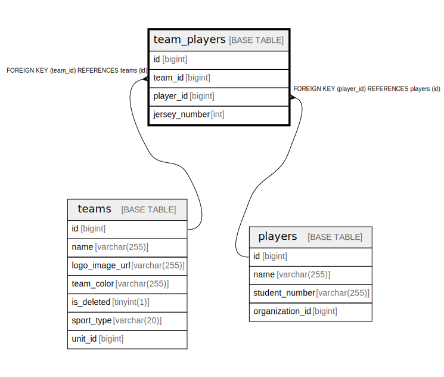

# team_players

## Description

<details>
<summary><strong>Table Definition</strong></summary>

```sql
CREATE TABLE `team_players` (
  `id` bigint NOT NULL AUTO_INCREMENT,
  `team_id` bigint NOT NULL,
  `player_id` bigint NOT NULL,
  `jersey_number` int DEFAULT NULL,
  PRIMARY KEY (`id`),
  UNIQUE KEY `uc_team_player` (`team_id`,`player_id`),
  KEY `FK_TEAM_PLAYERS_ON_PLAYERS` (`player_id`),
  CONSTRAINT `FK_TEAM_PLAYERS_ON_PLAYERS` FOREIGN KEY (`player_id`) REFERENCES `players` (`id`),
  CONSTRAINT `FK_TEAM_PLAYERS_ON_TEAMS` FOREIGN KEY (`team_id`) REFERENCES `teams` (`id`)
) ENGINE=InnoDB DEFAULT CHARSET=utf8mb4 COLLATE=utf8mb4_0900_ai_ci
```

</details>

## Columns

| Name | Type | Default | Nullable | Extra Definition | Children | Parents | Comment |
| ---- | ---- | ------- | -------- | ---------------- | -------- | ------- | ------- |
| id | bigint |  | false | auto_increment |  |  |  |
| team_id | bigint |  | false |  |  | [teams](teams.md) |  |
| player_id | bigint |  | false |  |  | [players](players.md) |  |
| jersey_number | int |  | true |  |  |  |  |

## Constraints

| Name | Type | Definition |
| ---- | ---- | ---------- |
| FK_TEAM_PLAYERS_ON_PLAYERS | FOREIGN KEY | FOREIGN KEY (player_id) REFERENCES players (id) |
| FK_TEAM_PLAYERS_ON_TEAMS | FOREIGN KEY | FOREIGN KEY (team_id) REFERENCES teams (id) |
| PRIMARY | PRIMARY KEY | PRIMARY KEY (id) |
| uc_team_player | UNIQUE | UNIQUE KEY uc_team_player (team_id, player_id) |

## Indexes

| Name | Definition |
| ---- | ---------- |
| FK_TEAM_PLAYERS_ON_PLAYERS | KEY FK_TEAM_PLAYERS_ON_PLAYERS (player_id) USING BTREE |
| PRIMARY | PRIMARY KEY (id) USING BTREE |
| uc_team_player | UNIQUE KEY uc_team_player (team_id, player_id) USING BTREE |

## Relations



---

> Generated by [tbls](https://github.com/k1LoW/tbls)
