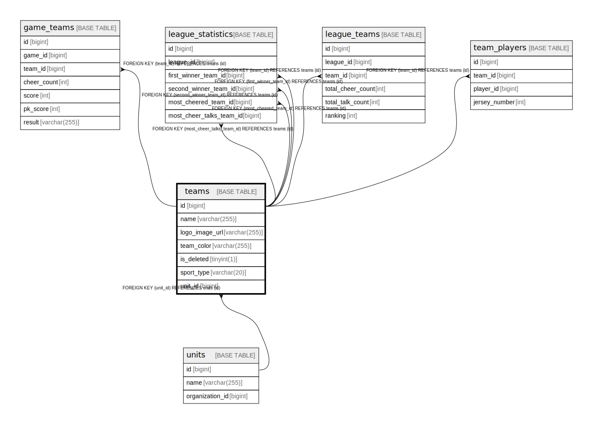

# teams

## Description

<details>
<summary><strong>Table Definition</strong></summary>

```sql
CREATE TABLE `teams` (
  `id` bigint NOT NULL AUTO_INCREMENT,
  `name` varchar(255) NOT NULL,
  `logo_image_url` varchar(255) DEFAULT NULL,
  `team_color` varchar(255) NOT NULL,
  `is_deleted` tinyint(1) NOT NULL DEFAULT '0',
  `sport_type` varchar(20) NOT NULL DEFAULT 'SOCCER',
  `unit_id` bigint DEFAULT NULL,
  PRIMARY KEY (`id`),
  KEY `fk_teams_on_unit` (`unit_id`),
  CONSTRAINT `fk_teams_on_unit` FOREIGN KEY (`unit_id`) REFERENCES `units` (`id`)
) ENGINE=InnoDB DEFAULT CHARSET=utf8mb4 COLLATE=utf8mb4_0900_ai_ci
```

</details>

## Columns

| Name | Type | Default | Nullable | Extra Definition | Children | Parents | Comment |
| ---- | ---- | ------- | -------- | ---------------- | -------- | ------- | ------- |
| id | bigint |  | false | auto_increment | [game_teams](game_teams.md) [league_statistics](league_statistics.md) [league_teams](league_teams.md) [team_players](team_players.md) |  |  |
| name | varchar(255) |  | false |  |  |  |  |
| logo_image_url | varchar(255) |  | true |  |  |  |  |
| team_color | varchar(255) |  | false |  |  |  |  |
| is_deleted | tinyint(1) | 0 | false |  |  |  |  |
| sport_type | varchar(20) | SOCCER | false |  |  |  |  |
| unit_id | bigint |  | true |  |  | [units](units.md) |  |

## Constraints

| Name | Type | Definition |
| ---- | ---- | ---------- |
| fk_teams_on_unit | FOREIGN KEY | FOREIGN KEY (unit_id) REFERENCES units (id) |
| PRIMARY | PRIMARY KEY | PRIMARY KEY (id) |

## Indexes

| Name | Definition |
| ---- | ---------- |
| fk_teams_on_unit | KEY fk_teams_on_unit (unit_id) USING BTREE |
| PRIMARY | PRIMARY KEY (id) USING BTREE |

## Relations



---

> Generated by [tbls](https://github.com/k1LoW/tbls)
