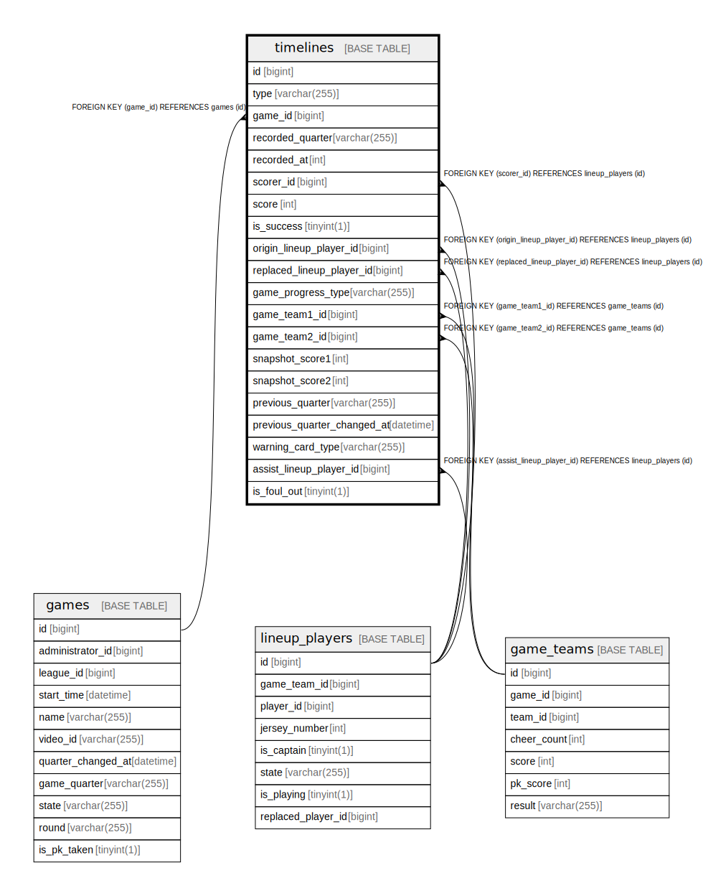

# timelines

## Description

<details>
<summary><strong>Table Definition</strong></summary>

```sql
CREATE TABLE `timelines` (
  `id` bigint NOT NULL AUTO_INCREMENT,
  `type` varchar(255) NOT NULL,
  `game_id` bigint NOT NULL,
  `recorded_quarter` varchar(255) NOT NULL,
  `recorded_at` int NOT NULL,
  `scorer_id` bigint DEFAULT NULL,
  `score` int DEFAULT NULL,
  `is_success` tinyint(1) DEFAULT NULL,
  `origin_lineup_player_id` bigint DEFAULT NULL,
  `replaced_lineup_player_id` bigint DEFAULT NULL,
  `game_progress_type` varchar(255) DEFAULT NULL,
  `game_team1_id` bigint DEFAULT NULL,
  `game_team2_id` bigint DEFAULT NULL,
  `snapshot_score1` int DEFAULT NULL,
  `snapshot_score2` int DEFAULT NULL,
  `previous_quarter` varchar(255) DEFAULT NULL,
  `previous_quarter_changed_at` datetime DEFAULT NULL,
  `warning_card_type` varchar(255) DEFAULT NULL,
  `assist_lineup_player_id` bigint DEFAULT NULL,
  `is_foul_out` tinyint(1) NOT NULL DEFAULT '0',
  PRIMARY KEY (`id`),
  KEY `FK_TIMELINES_ON_GAMES` (`game_id`),
  KEY `FK_TIMELINES_ON_GAME_TEAMS_1` (`game_team1_id`),
  KEY `FK_TIMELINES_ON_GAME_TEAMS_2` (`game_team2_id`),
  KEY `FK_TIMELINES_ON_ORIGIN_LINEUP_PLAYERS` (`origin_lineup_player_id`),
  KEY `FK_TIMELINES_ON_REPLACED_LINEUP_PLAYERS` (`replaced_lineup_player_id`),
  KEY `FK_TIMELINES_ON_LINEUP_PLAYERS_SCORER` (`scorer_id`),
  KEY `fk_timelines_assist_player` (`assist_lineup_player_id`),
  CONSTRAINT `fk_timelines_assist_player` FOREIGN KEY (`assist_lineup_player_id`) REFERENCES `lineup_players` (`id`) ON DELETE CASCADE,
  CONSTRAINT `FK_TIMELINES_ON_GAME_TEAMS_1` FOREIGN KEY (`game_team1_id`) REFERENCES `game_teams` (`id`),
  CONSTRAINT `FK_TIMELINES_ON_GAME_TEAMS_2` FOREIGN KEY (`game_team2_id`) REFERENCES `game_teams` (`id`),
  CONSTRAINT `FK_TIMELINES_ON_GAMES` FOREIGN KEY (`game_id`) REFERENCES `games` (`id`),
  CONSTRAINT `FK_TIMELINES_ON_LINEUP_PLAYERS_SCORER` FOREIGN KEY (`scorer_id`) REFERENCES `lineup_players` (`id`),
  CONSTRAINT `FK_TIMELINES_ON_ORIGIN_LINEUP_PLAYERS` FOREIGN KEY (`origin_lineup_player_id`) REFERENCES `lineup_players` (`id`),
  CONSTRAINT `FK_TIMELINES_ON_REPLACED_LINEUP_PLAYERS` FOREIGN KEY (`replaced_lineup_player_id`) REFERENCES `lineup_players` (`id`)
) ENGINE=InnoDB DEFAULT CHARSET=utf8mb4 COLLATE=utf8mb4_0900_ai_ci
```

</details>

## Columns

| Name | Type | Default | Nullable | Extra Definition | Children | Parents | Comment |
| ---- | ---- | ------- | -------- | ---------------- | -------- | ------- | ------- |
| id | bigint |  | false | auto_increment |  |  |  |
| type | varchar(255) |  | false |  |  |  |  |
| game_id | bigint |  | false |  |  | [games](games.md) |  |
| recorded_quarter | varchar(255) |  | false |  |  |  |  |
| recorded_at | int |  | false |  |  |  |  |
| scorer_id | bigint |  | true |  |  | [lineup_players](lineup_players.md) |  |
| score | int |  | true |  |  |  |  |
| is_success | tinyint(1) |  | true |  |  |  |  |
| origin_lineup_player_id | bigint |  | true |  |  | [lineup_players](lineup_players.md) |  |
| replaced_lineup_player_id | bigint |  | true |  |  | [lineup_players](lineup_players.md) |  |
| game_progress_type | varchar(255) |  | true |  |  |  |  |
| game_team1_id | bigint |  | true |  |  | [game_teams](game_teams.md) |  |
| game_team2_id | bigint |  | true |  |  | [game_teams](game_teams.md) |  |
| snapshot_score1 | int |  | true |  |  |  |  |
| snapshot_score2 | int |  | true |  |  |  |  |
| previous_quarter | varchar(255) |  | true |  |  |  |  |
| previous_quarter_changed_at | datetime |  | true |  |  |  |  |
| warning_card_type | varchar(255) |  | true |  |  |  |  |
| assist_lineup_player_id | bigint |  | true |  |  | [lineup_players](lineup_players.md) |  |
| is_foul_out | tinyint(1) | 0 | false |  |  |  |  |

## Constraints

| Name | Type | Definition |
| ---- | ---- | ---------- |
| fk_timelines_assist_player | FOREIGN KEY | FOREIGN KEY (assist_lineup_player_id) REFERENCES lineup_players (id) |
| FK_TIMELINES_ON_GAME_TEAMS_1 | FOREIGN KEY | FOREIGN KEY (game_team1_id) REFERENCES game_teams (id) |
| FK_TIMELINES_ON_GAME_TEAMS_2 | FOREIGN KEY | FOREIGN KEY (game_team2_id) REFERENCES game_teams (id) |
| FK_TIMELINES_ON_GAMES | FOREIGN KEY | FOREIGN KEY (game_id) REFERENCES games (id) |
| FK_TIMELINES_ON_LINEUP_PLAYERS_SCORER | FOREIGN KEY | FOREIGN KEY (scorer_id) REFERENCES lineup_players (id) |
| FK_TIMELINES_ON_ORIGIN_LINEUP_PLAYERS | FOREIGN KEY | FOREIGN KEY (origin_lineup_player_id) REFERENCES lineup_players (id) |
| FK_TIMELINES_ON_REPLACED_LINEUP_PLAYERS | FOREIGN KEY | FOREIGN KEY (replaced_lineup_player_id) REFERENCES lineup_players (id) |
| PRIMARY | PRIMARY KEY | PRIMARY KEY (id) |

## Indexes

| Name | Definition |
| ---- | ---------- |
| fk_timelines_assist_player | KEY fk_timelines_assist_player (assist_lineup_player_id) USING BTREE |
| FK_TIMELINES_ON_GAME_TEAMS_1 | KEY FK_TIMELINES_ON_GAME_TEAMS_1 (game_team1_id) USING BTREE |
| FK_TIMELINES_ON_GAME_TEAMS_2 | KEY FK_TIMELINES_ON_GAME_TEAMS_2 (game_team2_id) USING BTREE |
| FK_TIMELINES_ON_GAMES | KEY FK_TIMELINES_ON_GAMES (game_id) USING BTREE |
| FK_TIMELINES_ON_LINEUP_PLAYERS_SCORER | KEY FK_TIMELINES_ON_LINEUP_PLAYERS_SCORER (scorer_id) USING BTREE |
| FK_TIMELINES_ON_ORIGIN_LINEUP_PLAYERS | KEY FK_TIMELINES_ON_ORIGIN_LINEUP_PLAYERS (origin_lineup_player_id) USING BTREE |
| FK_TIMELINES_ON_REPLACED_LINEUP_PLAYERS | KEY FK_TIMELINES_ON_REPLACED_LINEUP_PLAYERS (replaced_lineup_player_id) USING BTREE |
| PRIMARY | PRIMARY KEY (id) USING BTREE |

## Relations



---

> Generated by [tbls](https://github.com/k1LoW/tbls)
